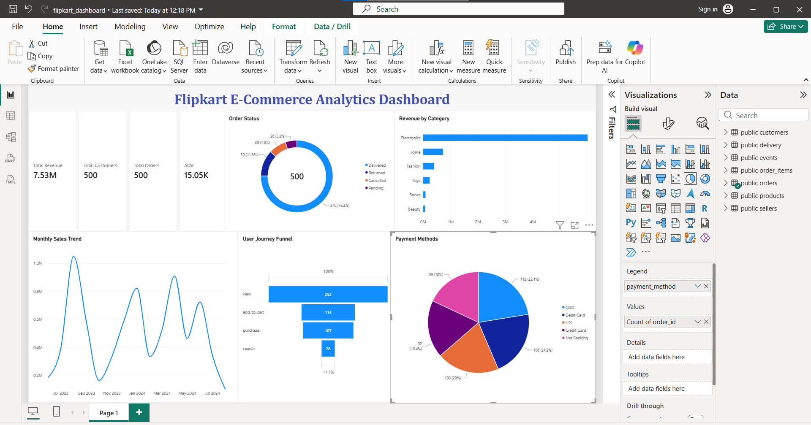

# Flipkart E-Commerce Analytics Dashboard

An end-to-end Data Analytics project analyzing 500+ orders, 500 customers, and 500 products across 7 tables using **SQL, Python, and Power BI**.



---

## 📊 Project Overview

This project simulates a real-world Flipkart analytics workflow — from synthetic data generation to interactive dashboarding — to uncover actionable business insights.

## 🛠️ Tools & Technologies

| Tool | Purpose |
|------|---------|
| **PostgreSQL** | Data storage and SQL analysis |
| **Python (Pandas)** | Synthetic data generation |
| **Power BI** | Interactive dashboard |
| **DAX** | Custom measures |
| **SQL** | Joins, Window Functions, CTEs, Aggregations |

## 📁 Project Structure
flipkart-ecommerce-analytics/
├── data/ # 7 CSV files (500 rows each)
├── sql/ # 7 SQL analysis files
├── scripts/ # Python data generator
├── dashboard/ # Power BI dashboard + screenshot
└── reports/ # Business insights


## 🔍 Key Analysis Performed

1. **Funnel Analysis** — View → Cart → Purchase drop-off
2. **RFM Segmentation** — Customer lifetime value segments
3. **Cohort Retention** — Monthly retention analysis
4. **Category Revenue** — Top performing categories
5. **Delivery Analysis** — Partner-wise performance
6. **Payment Methods** — UPI vs COD vs Cards

## 💡 Key Insights

- **Electronics** = Top revenue category (high-value items like iPhone, MacBook)
- **44% funnel drop-off** at view→cart stage — checkout UX improvement needed
- **75% orders Delivered**, 10% Returned
- **UPI most popular payment** (36%) — COD at 28%
- **Average Order Value**: ₹15.05K

## 📈 Dashboard Features

- 4 KPI Cards (Revenue, Orders, Customers, AOV)
- Line Chart — Monthly Sales Trend
- Bar Chart — Revenue by Category
- Pie Chart — Payment Methods
- Donut Chart — Order Status
- Funnel Chart — User Journey

## 🚀 How to Run

1. **Clone the repository:**
   ```bash
   git clone https://github.com/anwar-78/flipkart-ecommerce-analytics.git

2. Run Python script to generate data:
python scripts/generate_data.py


3. Load data into PostgreSQL using sql/01_setup.sql

4. Open dashboard/flipkart_dashboard.pbix in Power BI Desktop